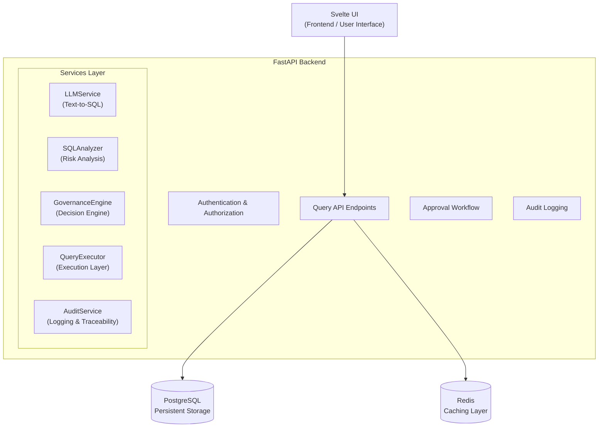

# Natural Language Database Gateway

This project is a secure gateway between natural language and a database: users submit requests, an LLM converts them into SQL, and a governance engine evaluates role permissions, risk level, and security policies to decide whether each query should be executed, sent for human approval, or denied.

project with FastAPI + PostgreSQL + Redis + Svelte for text-to-SQL with governance and approval workflow.



## Run

```bash
docker compose up --build -d
```

Services:
- Backend: `http://localhost:8000`
- Frontend: `http://localhost:8501`

## Seeded users
- `admin@example.com / admin123`
- `analyst@example.com / analyst123`
- `developer@example.com / developer123`
- `viewer@example.com / viewer123`
- `restricted@example.com / restricted123`
